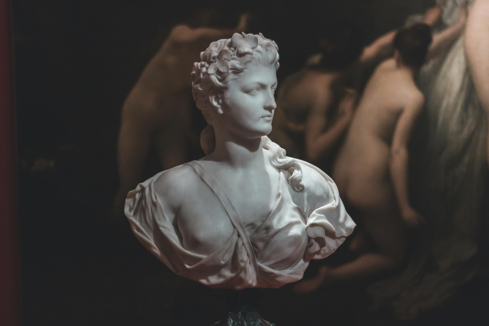
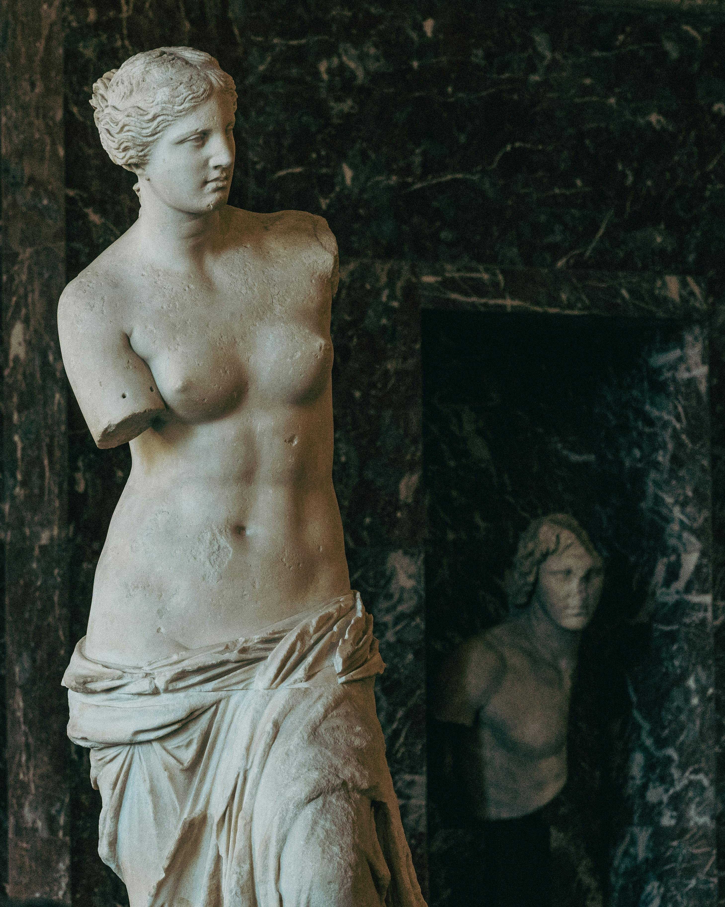

<!DOCTYPE html>
<html lang="fr">

<head>
    <meta charset="utf-8">
    <meta name="viewport" content="width=device-width, initial-scale=1, shrink-to-fit=no">
    <meta name="description" content="Free Web tutorials">
    <title>Dédale des couleurs</title>
    <link rel="stylesheet" href="https://maxcdn.bootstrapcdn.com/bootstrap/4.0.0/css/bootstrap.min.css">
    <link rel="stylesheet" href="style.css.css">
</head>

<body>

    <nav class="navbar navbar-expand-lg navbar-light bg-light">
        <a class="navbar-brand" href="#">DÉDALE DES COULEURS</a>
        <button class="navbar-toggler" type="button" data-toggle="collapse" data-target="#navbarNav"
            aria-controls="navbarNav" aria-expanded="false" aria-label="Toggle navigation">
            
        </button>
        

            <ul class="navbar-nav ml-auto">
                <li class="nav-item">
                    <a class="nav-link" href="#lesoeuvres">Les oeuvres</a>
                </li>
                <li class="nav-item">
                    <a class="nav-link" href="#monhistoire">Mon Histoire</a>
                </li>
                <li class="nav-item">
                    <a class="nav-link" href="#grostitrecontact">Contact</a>
                </li>
                <li class="nav-item">
                    <a class="nav-link" href="#grostitreapropos">À propos</a>
                </li>
            </ul>
        

    </nav>

    

        
    

    

        

            

                <h1>Les oeuvres</h1>
                
            

        

        

            

                
            

            

                
            

        

        

            

                
            

            

                
            

        

        

            

                
            

        

        

            

                
            

        

        

            

                
            

        

        

            

                

                    <h1>Mon Histoire</h1>
                

            

        

        

            

                

                    
 Passionnée d’art et d’histoire depuis ma plus tendre enfance, j’ai décidé
                        d’allier ces deux aspects de ma vie pour créer ma galerie. Une exposition que j’imagine depuis
                        plusieurs années, qui se veut expressive sur la beauté du monde antique. La sculpture grecque est
                        fascinante, c’est pourquoi cette galerie s’articule autour de cet art. Les salles seront le
                        spectacle de l’expression de cette pierre blanchâtre et pure.

                

            

        

        

            

                

                    <a id="jeuconcours">Jeu Concours</a>
                

            

        

        

            

                

                    <a id="textejeu">
                          Tente de remporter une caricature sculptée à ton effigie !  Inscris-toi
                        ci-dessous</a>

                    <form>
                        

                            <input type="email" class="form-control" id="email" placeholder="Adresse mail">
                        

                        

                            <button type="submit" class="btn btn-primary">Envoyer</button>
                        

                    </form>
                

            

        

        

            

                

                    <a id="grostitrecontact">Contact   13 PLACE VENDÔME   75000 PARIS   Tel :
                        06.71.97.54.18  Email : dedale@gmail.com </a>
                

            

        

        

            

                

                    <a id="grostitreapropos">À propos   NOÉ BROUTIN - ALEXANE CASSEGRAIN - SOLAL DELABY - JULIA SAAB  L3
                        INFO COM  G5</a>
                

            

        

    

    
    
    

</body>

</html>
# d-dale-des-couleurs
